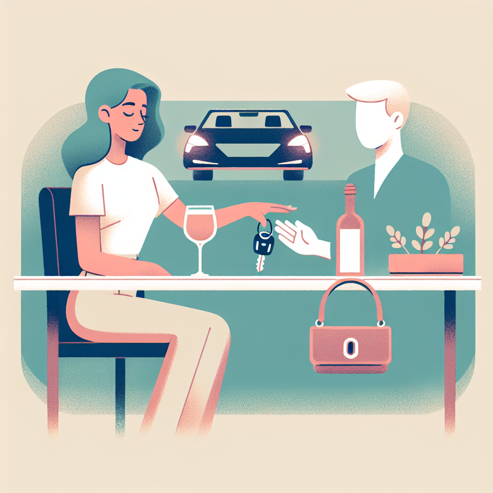
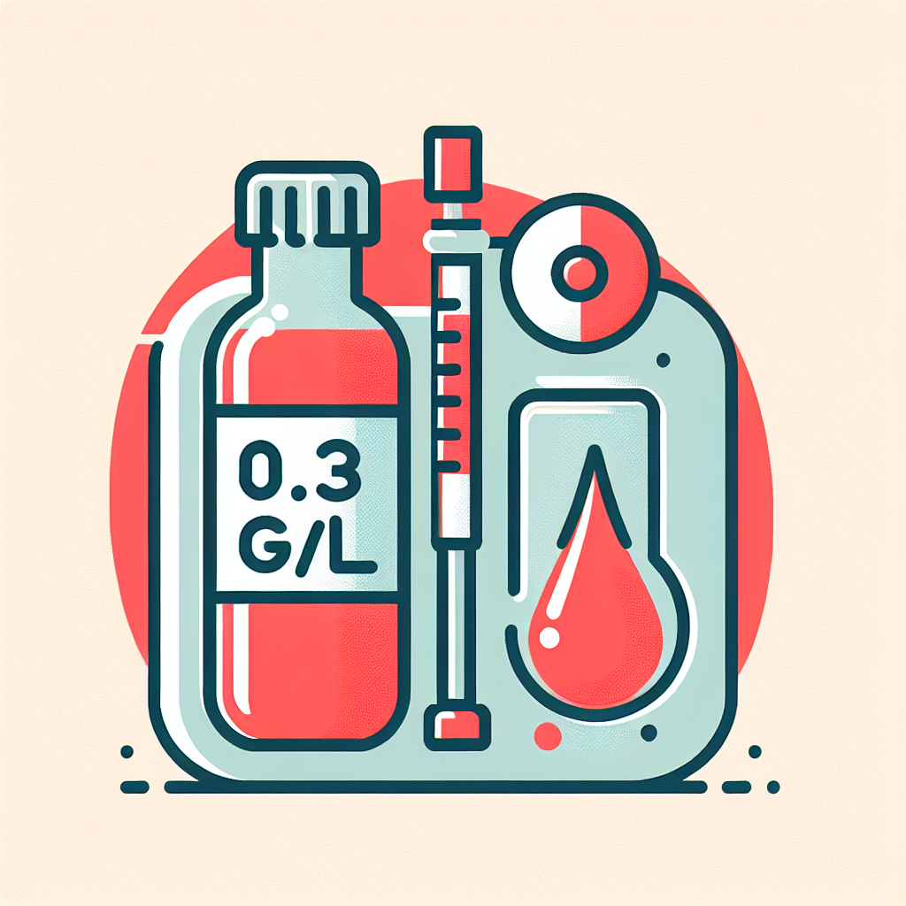
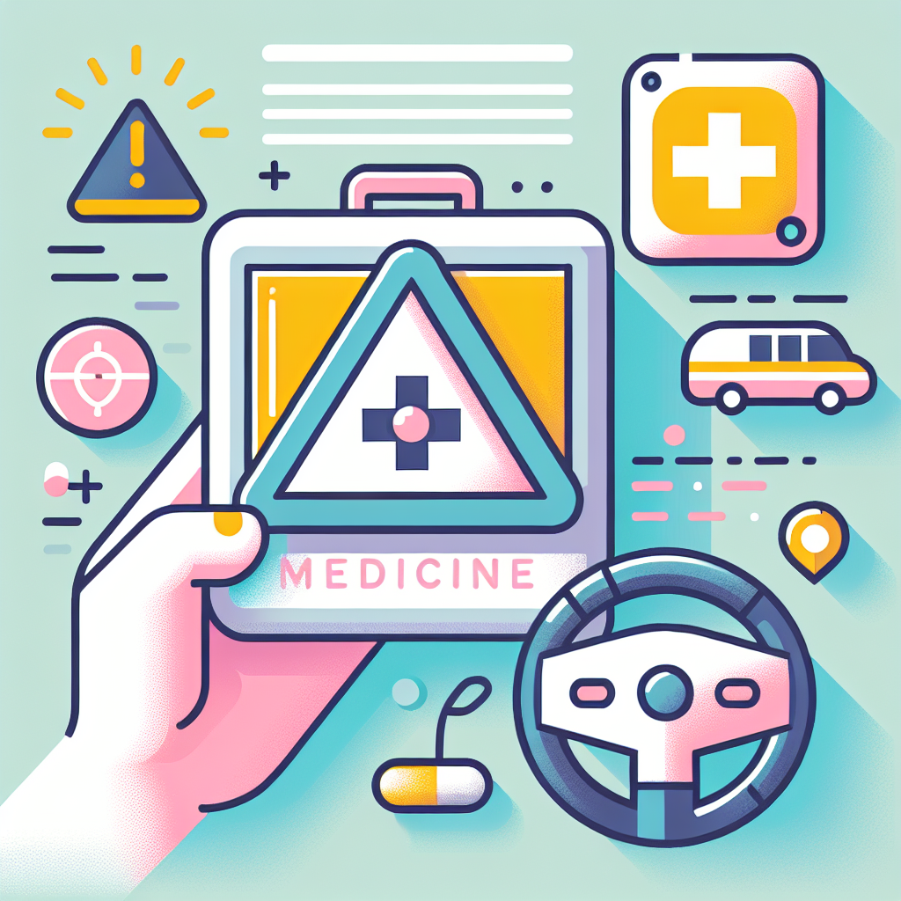
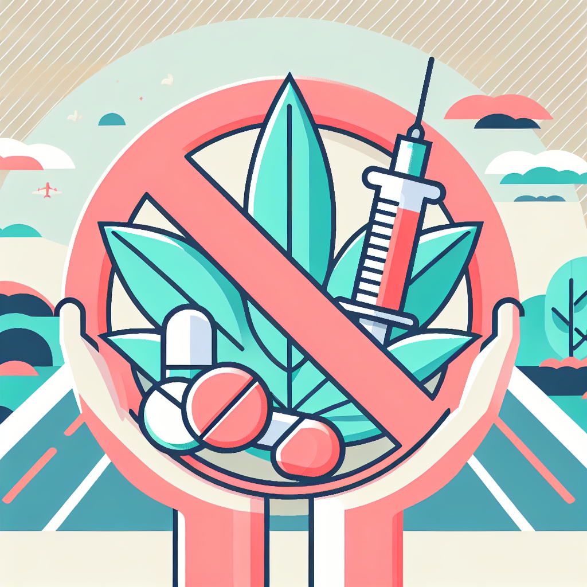
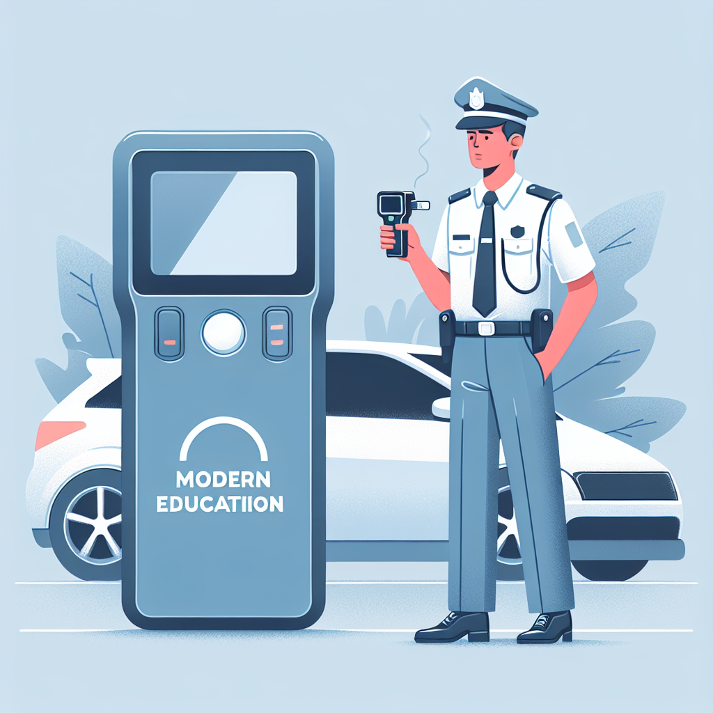

# Module : L'alcool, la drogue et les médicaments

## 1. Introduction

Conduire est un acte qui demande une précision absolue et une lucidité totale. En Tunisie, la loi impose que tout conducteur soit en pleine possession de ses moyens physiques et psychiques. L'introduction dans le sang de substances comme l'alcool, les stupéfiants ou certains médicaments modifie radicalement ta perception de la route, tes réflexes et ton jugement. Ce n'est pas seulement une question de respect du Code, c'est une question de vie ou de mort.

> **Le saviez-vous ?**
> En Tunisie, l'alcool est impliqué dans une part significative des accidents mortels. Même à faible dose, il multiplie par deux le risque d'accident, car il commence à agir sur le cerveau bien avant que tu ne te sentes "ivre".

## 2. L'alcool au volant : les règles et les seuils

### Le seuil légal d'interdiction
La réglementation tunisienne est stricte pour garantir la sécurité de tous. Tu es considéré comme étant sous l'empire d'un état alcoolique dès que le taux d'alcool pur dans ton sang est **égal ou supérieur à 0,3 gramme par litre (0,3 g/l)**.

*   **Le contrôle :** Les agents peuvent te soumettre à un test de l'air expiré (éthylotest).
*   **La vérification :** Si le test est positif, ou si tu refuses de souffler, une analyse de sang est obligatoire. Pour être valable, le médecin doit prélever au moins **12 ml de sang**.

### Les sanctions et le retrait de points
La conduite en état d'ébriété n'est pas une simple amende, c'est un **délit**. Voici ce que tu risques :
*   **Emprisonnement :** Jusqu'à **6 mois** de prison.
*   **Amende :** De **200 à 500 Dinars (DT)**.
*   **Retrait de points :** **4 points** sont retirés d'office de ton capital de 25 points.
*   **Suspension du permis :** Ton permis peut être retiré immédiatement pour une durée allant jusqu'à **6 mois**.

> **Attention :** Le refus de se soumettre au test de dépistage est puni des **mêmes peines** que si tu étais positif.

## 3. La drogue et les médicaments

### Médicaments tranquillisants et conduite
L'Article 7 de la loi interdit formellement de conduire après avoir consommé des **médicaments tranquillisants** ou tout produit pouvant affecter tes aptitudes. 

*   **Effets secondaires :** Somnolence, vertiges, et allongement du temps de réaction. 
*   **Vigilance :** Avant de prendre le volant, vérifie toujours la notice ou demande à ton médecin si le traitement est compatible avec la conduite.

### Les produits altérant les facultés
La consommation de stupéfiants (drogues) tombe sous le coup de l'interdiction de conduire avec des facultés altérées. Ces substances provoquent :
*   Une mauvaise évaluation des distances et des vitesses.
*   Un rétrécissement du champ visuel.
*   Une modification du comportement (agressivité ou euphorie excessive).

## 4. Sanctions aggravées en cas d'accident

Si tu provoques un accident corporel alors que tu es sous l'emprise de l'alcool ou de produits interdits, les sanctions deviennent extrêmement lourdes :
*   **Blessure involontaire :** La peine de prison peut monter à **3 ans** et l'amende à **3 000 DT**.
*   **Homicide involontaire :** La peine peut atteindre **5 ans** de prison et **5 000 DT** d'amende.
*   **Retrait du permis :** Il peut être porté à **4 ans** en cas d'accident grave sous alcool.

## 3. Le conseil du moniteur :

> "Ne joue pas avec ta vie pour un moment de fête. Si tu as bu, ou si tu prends un traitement médical fort, utilise un taxi ou demande à un ami sobre de te ramener. En Tunisie, la solidarité sur la route commence par ne pas prendre de risques inutiles pour soi et pour les autres."

### **3. PROMPTS IMAGES**

1.  **Fichier :** 1_sobre_conduite.jpg | **Prompt :** Modern educational vector illustration, flat design, clean lines, a driver at a social gathering politely pushing away a glass of wine, car keys on the table, soft pastel colors, minimalist.
2.  **Fichier :** 2_seuil_alcool.jpg | **Prompt :** Modern educational vector illustration, flat design, clean lines, a large red "0.3 g/l" sign next to a stylized medical blood vial and a breathalyzer, soft pastel colors, minimalist.
33.  **Fichier :** 3_medicaments_danger.jpg | **Prompt :** Modern educational vector illustration, flat design, clean lines, a medicine box with a warning triangle icon showing a car inside, a hand holding a steering wheel looking slightly blurry, soft pastel colors, minimalist.
4.  **Fichier :** 4_drogue_interdit.jpg | **Prompt :** Modern educational vector illustration, flat design, clean lines, a collage of a pill, a leaf, and a syringe inside a red prohibition circle, background shows a safe road, soft pastel colors, minimalist.
5.  **Fichier :** 5_controle_police.jpg | **Prompt :** Modern educational vector illustration, flat design, clean lines, a Tunisian traffic officer in uniform holding a modern digital breathalyzer next to a stopped car, professional and safe atmosphere, soft colors.