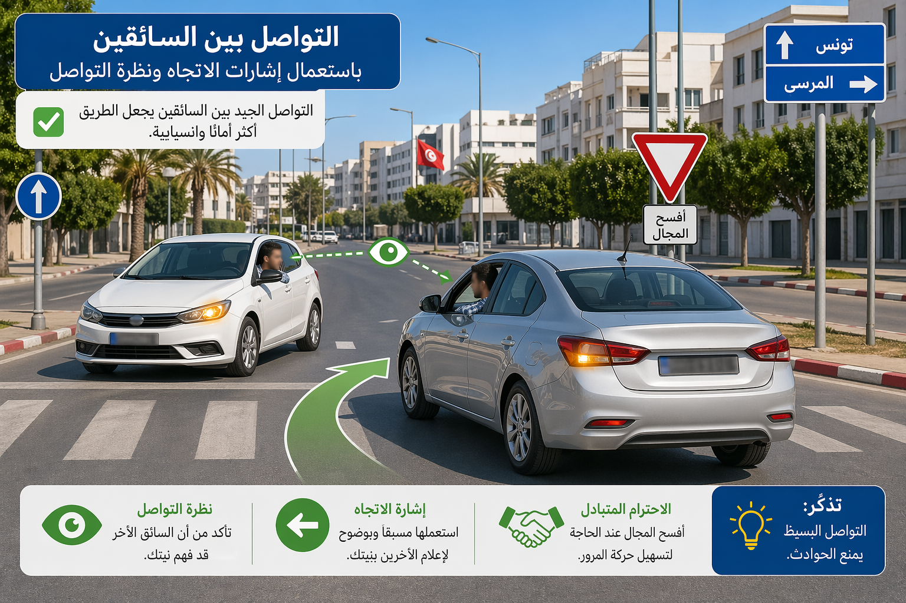
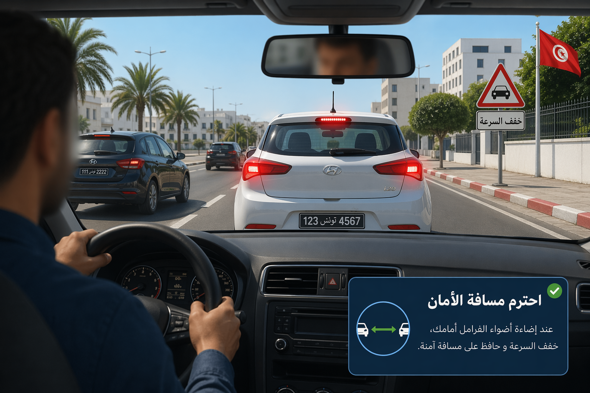
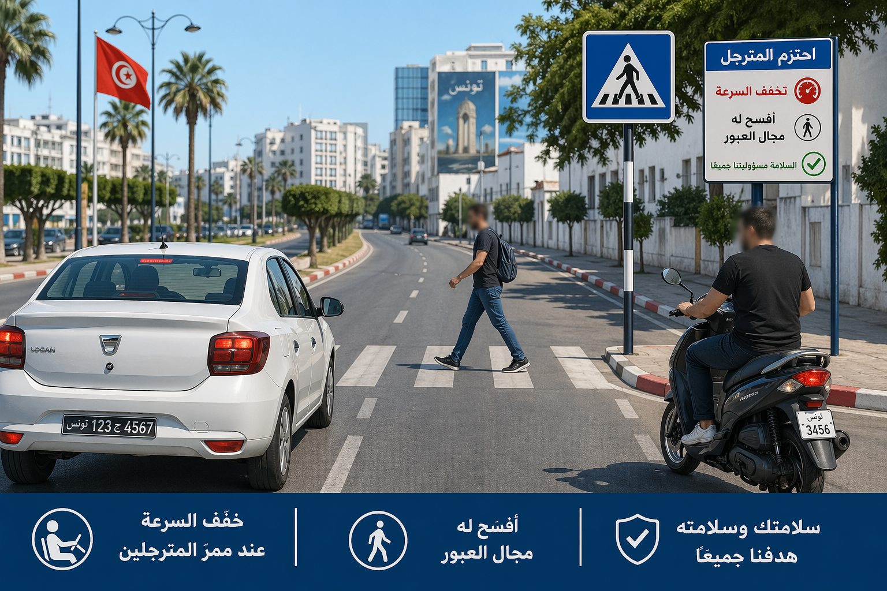
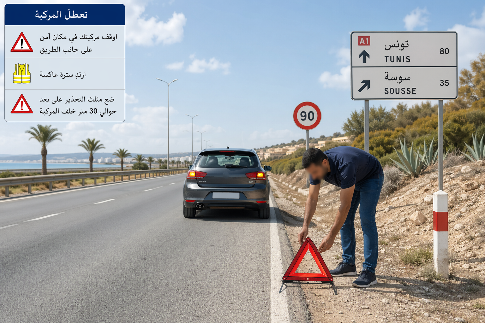
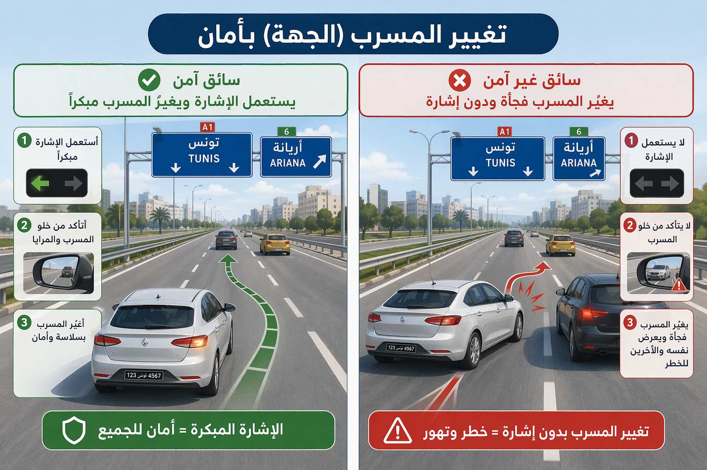

# Module : Communiquer avec les autres

## 1. Introduction
Conduire, ce n'est pas seulement tenir un volant et suivre sa voie. C'est aussi envoyer des messages clairs aux autres usagers et comprendre les leurs. Un clignotant oublié, un freinage brutal ou un coup d'avertisseur mal utilisé peuvent suffire a creer une mauvaise interpretation et provoquer un choc, un refus de priorite ou une manoeuvre d'urgence.

> Le saviez-vous ? En Tunisie, les donnees diffusees par l'ONSR pour l'annee 2024 montrent que l'inattention et l'etourderie ont represente plus de 42% des accidents. Mieux communiquer, c'est donc aussi reduire une grande partie du risque.

## 2. Les bases de la communication sur la route

### Communiquer, c'est prevenir
Avant de changer de direction, ralentir, depasser ou reprendre sa voie, le conducteur doit s'assurer qu'il peut le faire sans danger et avertir les autres usagers en temps opportun. En pratique, cela veut dire :

- annoncer son intention assez tot,
- observer les retroviseurs avant d'agir,
- verifier l'angle mort,
- executer la manoeuvre sans hesitation inutile.

La bonne communication routiere repose sur trois questions simples :

- Qu'est-ce que je vais faire ?
- Est-ce que les autres peuvent le comprendre ?
- Est-ce que je leur laisse le temps de reagir ?

### Les clignotants : un langage obligatoire
Les feux indicateurs de changement de direction doivent etre utilises avant toute manoeuvre et au bon moment. Ils servent notamment a annoncer :

- un changement de file,
- un depassement,
- un rabattement apres depassement,
- un virage,
- une insertion dans la circulation,
- une sortie de stationnement.

Un clignotant mis trop tard ne sert presque a rien. Un clignotant oublie cree une surprise. Et sur la route, la surprise est souvent l'ennemi de la securite.

Repere utile :

- a 50 km/h, le vehicule parcourt environ 14 m en 1 seconde,
- a 90 km/h, il parcourt environ 25 m en 1 seconde.

Cela veut dire qu'un signal donne seulement une seconde avant la manoeuvre peut etre insuffisant pour le conducteur derriere.

### Les feux stop : un message de ralentissement immediat
Les feux de freinage doivent s'allumer des le debut du freinage. Ils avertissent le conducteur qui suit qu'il faut reduire sa vitesse ou se preparer a s'arreter.

Un vehicule dont les feux stop sont defectueux communique mal. Le risque de collision arriere augmente, surtout en circulation dense, la nuit ou sous la pluie.

### L'avertisseur sonore : utile, mais jamais agressif
L'avertisseur sonore n'est pas fait pour exprimer l'impatience ou la colere. Il sert uniquement a donner les avertissements necessaires.

En agglomeration, il ne doit etre utilise que pour eviter un accident. Entre le coucher du soleil et le lever du jour, l'usage normal doit privilegier les signaux lumineux, l'avertisseur sonore n'etant admis qu'en cas de necessite absolue.

Bon reflexe :

- un coup bref,
- une intention claire,
- jamais de klaxon continu ou agressif.

Mauvais reflexe :

- klaxonner pour faire pression,
- klaxonner dans un embouteillage,
- klaxonner parce qu'un usager hesite.

L'usage abusif de l'avertisseur sonore fait partie des contraventions. Il expose a une amende de 10 dinars. L'usage de generateurs a sons multiples ou aigus est egalement sanctionne par une amende de 10 dinars.

### La communication par la position du vehicule
Sur la route, on parle aussi avec la position du vehicule :

- se placer pres du bord droit montre que l'on maintient sa trajectoire normale,
- se decaler pour tourner prepare les autres a comprendre la manoeuvre,
- s'approcher trop pres d'un autre vehicule peut etre percu comme une pression,
- zigzaguer ou hesiter cree de l'incertitude.

Un conducteur previsible est plus facile a lire. Un conducteur confus oblige les autres a improviser.

### La communication avec les usagers vulnerables
Les pietons, cyclistes, conducteurs de deux-roues et personnes agees n'interpretent pas toujours les situations de la meme maniere qu'un automobiliste. Il faut donc communiquer plus tot et plus clairement avec eux.

Exemples :

- a l'approche d'un passage pour pietons, reduire visiblement sa vitesse,
- pres d'une ecole, montrer par sa conduite que l'on est pret a s'arreter,
- a cote d'un deux-roues, laisser un espace lateral suffisant et eviter les manoeuvres brusques,
- a l'approche d'un bus a l'arret, anticiper la descente et la traversee de passagers.

## 2. Les situations ou il faut renforcer sa communication

### Avant un changement de direction
La regle est simple :

1. observer,
2. signaler,
3. manoeuvrer.

Changer de direction sans s'assurer a l'avance que l'on peut le faire sans danger et sans avertir les autres usagers est une contravention de 5e categorie, soit 60 dinars.

### En cas de panne ou d'obstacle
Si le vehicule en panne ou son chargement constitue un danger, le conducteur doit assurer la presignalisation.

Repere chiffré obligatoire :

- triangle de danger a au moins 30 m sur route,
- triangle de danger a 100 m sur autoroute,
- le triangle doit etre visible a au moins 50 m.

En agglomeration, lorsque 30 m ne peuvent pas etre respectes, il peut etre place a une distance inferieure.

En plus du triangle, on peut activer simultanement les clignotants de detresse ou utiliser un feu portatif clignotant jaune.

### En cas de gene involontaire
Si une gene a la circulation apparait sans etre voulue par le conducteur, il doit la signaler aux autres usagers et prendre les mesures necessaires pour la faire disparaitre au plus vite.

Ne pas signaler cette gene expose a une amende de 20 dinars.

### Avec les vehicules prioritaires
Quand un vehicule prioritaire ou d'intervention urgente annonce son approche par ses signaux speciaux, les autres usagers doivent faciliter son passage.

Cela demande une communication double :

- le vehicule prioritaire annonce sa presence,
- les autres conducteurs montrent clairement qu'ils ont compris en liberant la voie sans geste brusque.

## 2. Les erreurs frequentes a eviter

### Croire que tout le monde a compris
Un autre usager n'a pas acces a vos intentions. Il ne voit que :

- votre vitesse,
- votre position,
- vos feux,
- votre trajectoire.

Si votre message est ambigu, il peut mal reagir.

### Signaler trop tard
Le bon signal est un signal donne avant l'action, pas pendant.

### Remplacer le clignotant par un coup de volant
Un changement de file brusque est une manoeuvre dangereuse, meme si la route semble libre.

### Confondre fermete et agressivite
Sur la route, la communication efficace est calme, lisible et anticipee. L'agressivite, elle, raccourcit le temps de reaction des autres et augmente les conflits.

## 3. Le conseil du moniteur :
> Sur la route, un conducteur prudent n'oblige jamais les autres a deviner : il annonce, il laisse le temps, et il agit avec clarte.

###
