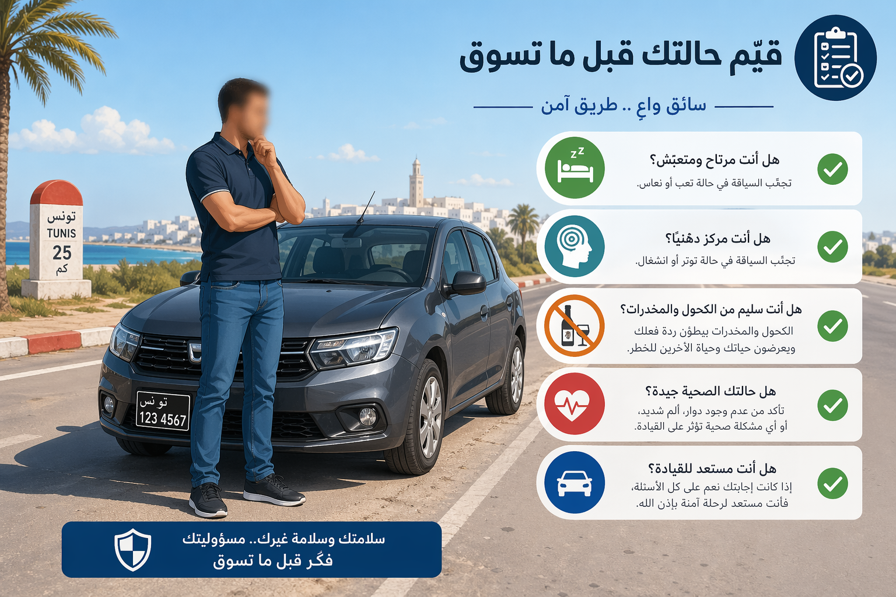
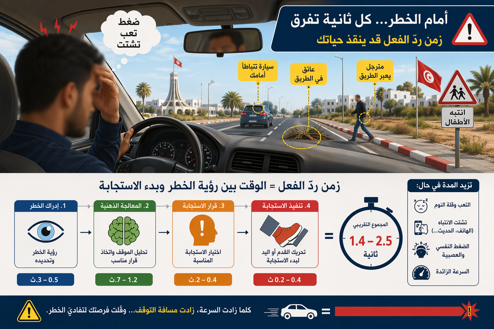
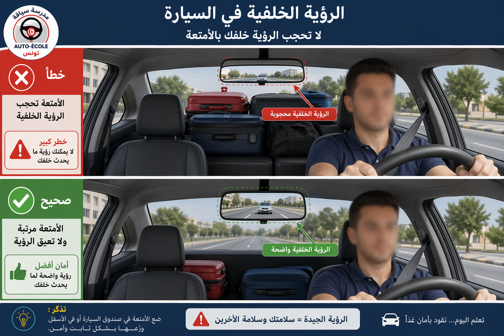

# Module : Évaluer son état physique et état psychologique

## 1. Introduction
Avant meme de demarrer, un bon conducteur se pose une question essentielle : suis-je vraiment en etat de conduire ? La route sanctionne tres vite les erreurs de jugement. Quand le corps est fatigue, quand l'esprit est perturbe, quand le stress, la colere ou la douleur prennent le dessus, la conduite devient moins precise, moins lucide et moins sure.

> Le saviez-vous ? Au 16 avril 2026, les donnees provisoires publiees par l'ONSR faisaient etat de 1200 accidents, 334 tues et 1552 blesses en Tunisie depuis le debut de l'annee. Derriere ces chiffres, il y a souvent une mauvaise evaluation du danger, un retard de reaction ou un mauvais choix.

## 2. Les verifications a faire avant de prendre le volant

### Le conducteur doit etre physiquement apte
La conduite exige des aptitudes physiques reelles :

- voir correctement,
- entendre les alertes utiles,
- bouger sans douleur bloquante,
- conserver une bonne coordination,
- supporter la duree du trajet.

Le code impose au conducteur d'avoir les aptitudes physiques et psychiques necessaires et d'etre dans un etat physique et mental lui permettant de conduire tout en gardant la maitrise de son vehicule.

Avant de partir, posez-vous ces questions :

- Ai-je de la fievre, une douleur importante ou un malaise ?
- Suis-je gene pour tourner la tete, freiner ou regarder les retroviseurs ?
- Ma vue est-elle nette aujourd'hui ?
- Ai-je pris un traitement qui me rend somnolent ou moins concentre ?

### Le conducteur doit etre psychologiquement disponible
On peut etre en bonne sante physique et etre pourtant dangereux au volant si l'etat psychologique n'est pas adapte.

Exemples de situations a risque :

- colere,
- tristesse intense,
- stress fort,
- anxiete,
- agitation,
- euphorie excessive,
- preoccupation mentale persistante.

Un esprit occupe n'analyse pas correctement la route. Il voit parfois, mais il ne traite pas bien l'information.

Repere chiffré :

- a 50 km/h, 1 seconde d'inattention represente environ 14 m parcourus,
- a 90 km/h, 1 seconde d'inattention represente environ 25 m.

Un conducteur preoccupe peut laisser passer plusieurs secondes sans vraie analyse de la situation.

### Evaluer son temps de reaction
Un conducteur alerte peut reagir en environ 0,75 a 1 seconde dans une situation attendue. Dans une situation plus complexe, une surprise, un etat emotionnel perturbe ou une distraction peuvent porter ce delai a 1,5 seconde, 2 secondes ou davantage.

Exemples :

- a 50 km/h, 1 seconde de reaction = environ 14 m,
- a 50 km/h, 2 secondes = environ 28 m,
- a 90 km/h, 2 secondes = environ 50 m.

Cette distance est deja parcourue avant meme d'appuyer sur le frein.

## 2. Les signaux d'alerte a ne pas ignorer

### Les signes physiques
Ne prenez pas le volant ou interrompez le trajet si vous ressentez :

- vertiges,
- nausees,
- vue trouble,
- maux de tete importants,
- douleur vive,
- faiblesse inhabituelle,
- tremblements,
- gene respiratoire.

### Les signes psychologiques
La conduite devient risquee si vous remarquez :

- irritation excessive,
- impulsivite,
- envie de "forcer",
- baisse d'attention,
- oublis repetes,
- erreurs de jugement,
- difficulte a rester calme.

### Les signes de surcharge mentale
Vous etes en surcharge quand vous conduisez mais que votre pensee reste ailleurs :

- dispute recente,
- probleme familial ou professionnel,
- urgence personnelle,
- pression horaire,
- telephone ou messages en tete.

Le danger n'est pas seulement ce qu'on regarde. Le danger, c'est aussi ce qu'on n'arrive plus a traiter correctement.

## 2. Comment reprendre la main avant que le risque n'apparaisse

### Faire une pause de decision
Avant de demarrer, prenez 30 secondes pour verifier quatre points :

- suis-je bien concentre ?
- suis-je bien repose ?
- suis-je physiquement a l'aise ?
- suis-je capable de conduire calmement ?

Si une seule reponse est non, il faut corriger la situation avant de partir.

### Adapter le trajet a son etat
Si vous n'etes pas au meilleur de votre forme :

- reduisez la vitesse,
- augmentez la distance de securite,
- evitez les trajets longs,
- reportez le depart si possible,
- passez le volant si une autre personne est en etat de conduire.

### Garder son champ de vision et ses mouvements libres
Le conducteur doit prendre toutes les precautions pour que ses possibilites de mouvement et son champ de vision ne soient pas reduits par les passagers, leur position, les objets transportes ou des elements poses sur les vitres.

Ne pas respecter cette obligation expose a une amende de 40 dinars.

## 2. Les cas ou il faut renoncer a conduire

### Apres une mauvaise nuit
Si la nuit a ete trop courte ou trop fragmentee, le risque augmente meme si vous pensez "tenir le coup".

### Sous l'effet d'un traitement, d'une douleur ou d'un choc emotionnel
Le bon reflexe n'est pas de tester ses limites sur la route.

### Pendant la periode probatoire
Les nouveaux conducteurs sont encore en phase d'apprentissage. La periode probatoire dure deux ans. Pendant cette phase, une mauvaise evaluation de son etat se paie souvent plus vite, car l'experience manque encore pour compenser.

### Quand on sent qu'on force
Un conducteur qui se dit :

- "je vais quand meme y aller",
- "ce n'est pas loin",
- "je ferai attention",

est parfois deja en train de minimiser un risque reel.

## 2. Sanctions et consequences

### Quand l'etat du conducteur devient une infraction
La conduite sous l'effet de l'alcool, de certains medicaments ou en etat de fatigue est interdite. Si cet etat conduit a une infraction grave ou a un accident, les sanctions peuvent aller :

- jusqu'au retrait immediat du permis dans certains cas,
- jusqu'a des peines d'amende ou d'emprisonnement,
- jusqu'a un alourdissement important si l'accident cause des blessures ou un deces.

### Ce qu'il faut retenir
L'evaluation de son etat n'est pas un detail de confort. C'est une decision de securite. Le meilleur conducteur n'est pas celui qui "tente quand meme". C'est celui qui sait dire non au bon moment.

## 3. Le conseil du moniteur :
> Avant de juger la route, commence toujours par te juger toi-meme : si ton corps ou ton esprit ne sont pas prets, reporte le trajet.

###
