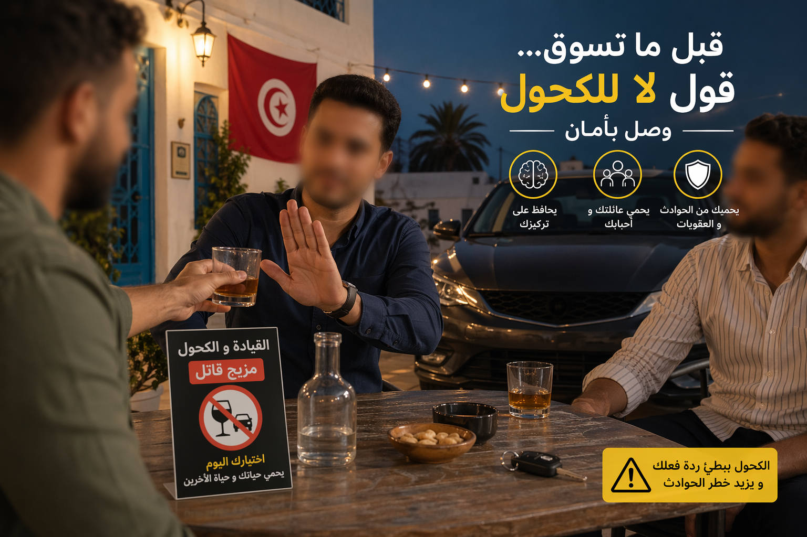
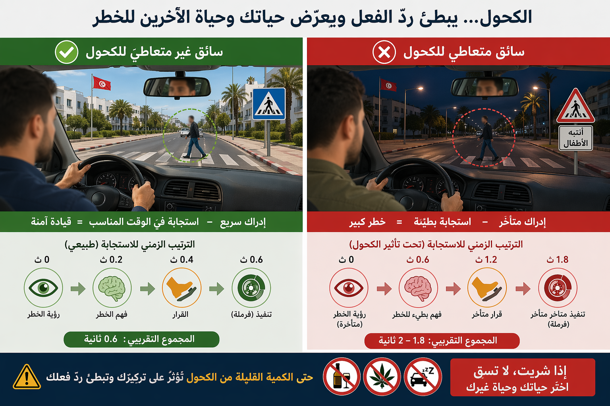
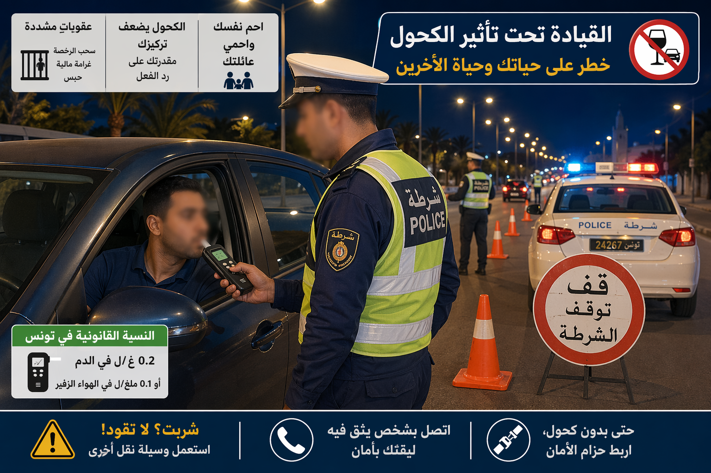
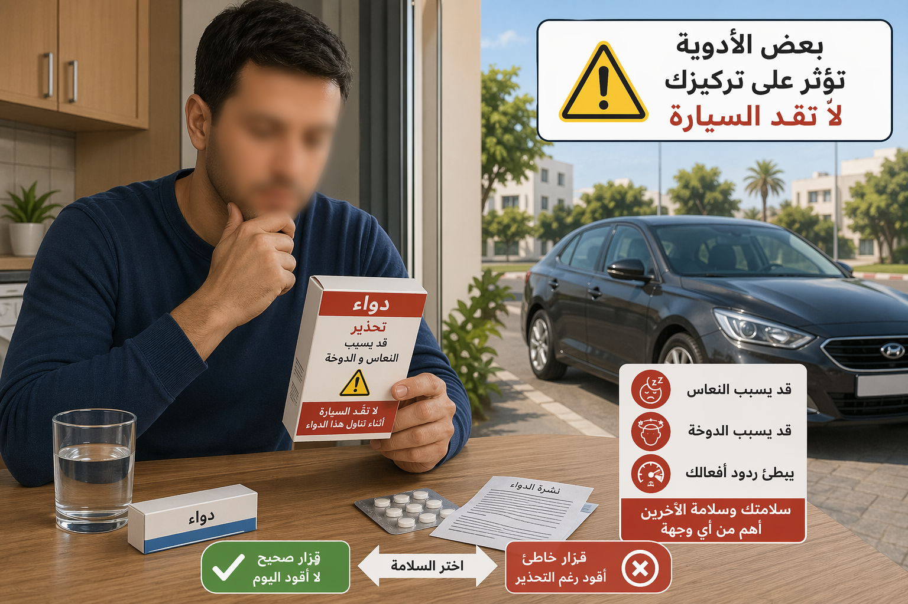

# Module : L'alcool, la drogue et les médicaments

## 1. Introduction
Un conducteur sous influence n'est jamais aussi maitre de lui-meme qu'il le croit. L'alcool diminue la vigilance, la drogue perturbe la perception et la decision, et certains medicaments ralentissent les reflexes ou provoquent une somnolence discretes mais tres dangereuses. Sur la route, quelques dixiemes de seconde perdus peuvent suffire a transformer une erreur en drame.

> Le saviez-vous ? Le seuil tunisien d'alcool pur dans le sang est de 0,3 g/l depuis le 1er mars 2016. Pour plusieurs categories de conducteurs, la tolerance est ramenee a 0,0 g/l.

## 2. Comprendre pourquoi ces produits rendent la conduite dangereuse

### L'alcool fausse l'evaluation
L'alcool agit sur plusieurs fonctions essentielles :

- le champ d'attention se retrecit,
- le temps de reaction s'allonge,
- l'evaluation des distances devient moins precise,
- la prise de risque augmente,
- la sensation de confiance devient trompeuse.

Repere chiffré :

- a 50 km/h, 1 seconde de reaction = 14 m parcourus,
- a 90 km/h, 1 seconde de reaction = 25 m parcourus.

Si l'alcool retarde la reaction, la distance parcourue avant freinage augmente automatiquement.

### La drogue perturbe la perception et la decision
Selon la substance, les effets peuvent etre differents :

- euphorie puis mauvaise appreciation du risque,
- lenteur,
- troubles de coordination,
- vision deformee,
- baisse de concentration,
- somnolence,
- agressivite ou impulsivite.

La dangerosite vient aussi du fait que le conducteur ne se rend pas toujours compte de sa propre degradation.

### Les medicaments ne sont pas toujours compatibles avec la conduite
Le code vise les medicaments tranquillisants et les produits pouvant affecter les aptitudes du conducteur. En pratique, il faut redoubler de prudence avec :

- sedatifs,
- anxiolytiques,
- somniferes,
- certains antalgiques,
- certains antihistaminiques,
- traitements qui provoquent vertiges ou baisse de vigilance.

Si une prise vous rend moins alerte, le risque commence avant meme que vous ne rouliez vite.

## 2. Les seuils a retenir

### Le seuil general
Un conducteur est considere sous l'empire d'un etat alcoolique a partir de :

- 0,3 g d'alcool pur par litre de sang.

### Les categories soumises a 0,0 g/l
La tolerance est ramenee a zero pour :

- les conducteurs stagiaires,
- les conducteurs des vehicules lourds de transport routier de marchandises,
- les conducteurs des vehicules de transport de personnes de plus de 8 places hors conducteur,
- les conducteurs du transport public routier non regulier de personnes,
- les conducteurs des vehicules de transport touristique,
- les formateurs et formateurs de formateurs pendant l'exercice de leur fonction.

Retenez l'idee simple :

- si vous conduisez, la seule quantite vraiment sure est 0.

### Les controles
Le depistage peut etre realise par l'air expire avec des appareils homologues. En cas de resultat positif, de refus ou de suspicion serieuse, des verifications complementaires peuvent etre faites.

Le refus de se soumettre a la procedure est sanctionne comme une infraction grave.

## 2. Les sanctions a connaitre

### Conduite sous etat alcoolique
La conduite sous l'empire d'un etat alcoolique expose a :

- jusqu'a 6 mois d'emprisonnement,
- une amende de 200 a 500 dinars,
- ou l'une de ces deux peines seulement.

### Refus de controle
Le refus de se soumettre a la procedure de preuve de l'etat alcoolique expose au meme niveau de gravite penale.

### Retrait du permis
Le permis peut etre retire, et meme retire immediatement dans certains cas, notamment en cas de conduite sous etat alcoolique ou de refus de controle.

En premiere situation grave, la duree de retrait peut aller jusqu'a 6 mois. En recidive ou en cas d'accident avec blessure ou deces, les consequences deviennent beaucoup plus lourdes.

### Si un accident survient
Quand un accident cause des blessures ou un homicide involontaire et que le conducteur est sous influence, les peines montent fortement :

- jusqu'a 3000 dinars d'amende et 3 ans d'emprisonnement pour certaines blessures involontaires aggravées,
- jusqu'a 5000 dinars d'amende et 5 ans d'emprisonnement dans certains cas d'homicide involontaire aggravé.

## 2. Les erreurs de raisonnement a corriger

### "Je me sens bien, donc je peux conduire"
Faux. Le ressenti n'est pas un outil fiable. L'alcool altere justement la capacite de se juger soi-meme.

### "Je n'ai pris qu'une petite quantite"
Faux. Avec une limite generale de 0,3 g/l, la marge est tres faible. Pour plusieurs conducteurs, elle est nulle.

### "C'est un medicament, donc ce n'est pas dangereux"
Faux. Un produit legal peut etre incompatible avec la conduite.

### "J'ai deja l'habitude"
Faux. L'habitude n'annule ni la somnolence, ni les troubles de concentration, ni le ralentissement des reflexes.

## 2. Les bons reflexes de prevention

### Avant de conduire

- ne pas boire,
- ne pas consommer de drogue,
- lire la notice du medicament,
- demander l'avis d'un medecin ou d'un pharmacien en cas de doute,
- prevoir un autre conducteur ou un autre moyen de retour.

### Pendant le trajet
Si vous sentez :

- une baisse de concentration,
- des yeux lourds,
- une sensation d'etre "au ralenti",
- des difficultes a garder la voie,

arretez-vous et ne poursuivez pas.

## 3. Le conseil du moniteur :
> Quand un produit change ton regard, ton jugement ou ton rythme, il change aussi ta conduite : dans le doute, on ne prend pas le volant.

###
