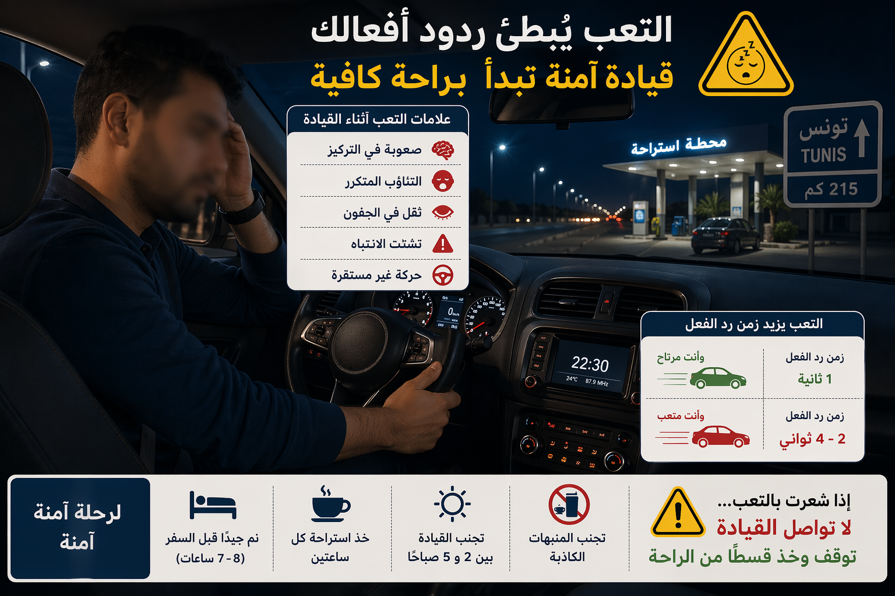
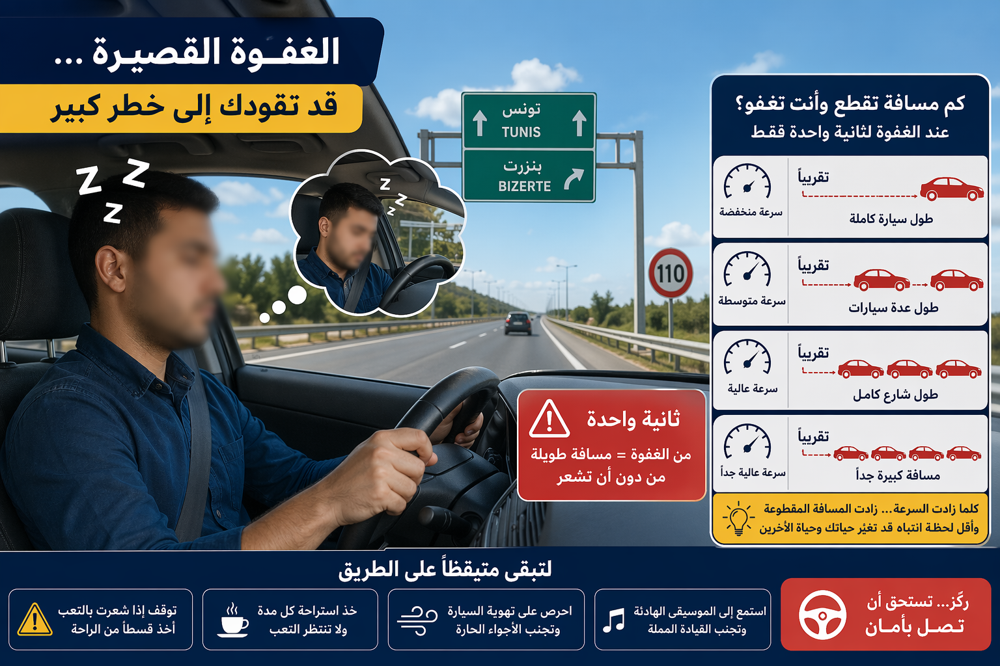
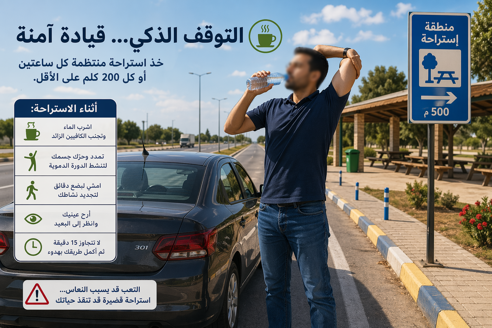
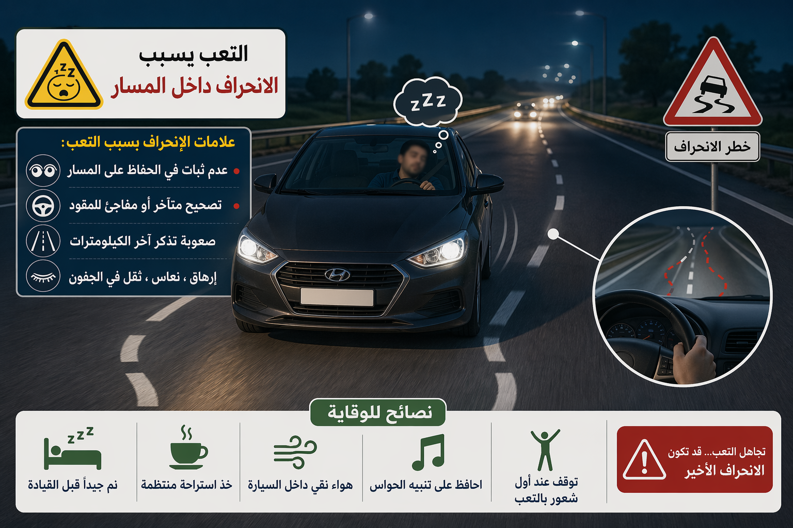

# Module : La fatigue et la vigilance

## 1. Introduction
La fatigue est un danger silencieux. Elle n'a pas toujours l'air spectaculaire, mais elle reduit l'attention, allonge le temps de reaction et fait disparaitre des informations entieres du champ mental du conducteur. Le vrai piege, c'est que beaucoup de conducteurs sentent la fatigue trop tard, au moment ou la vigilance est deja en chute.

> Le saviez-vous ? Des donnees de securite au travail couramment reprises en prevention montrent qu'une personne restee eveillee 17 heures peut presenter une degradation des performances comparable a un taux d'alcoolemie de 0,05, et 24 heures d'eveil peuvent approcher l'equivalent de 0,10. Autrement dit : la fatigue peut rendre dangereux presque comme l'alcool.

## 2. Comprendre la fatigue au volant

### La fatigue agit sur trois fonctions essentielles

- percevoir,
- decider,
- agir.

Quand la fatigue augmente, le conducteur :

- voit moins bien les details,
- traite moins vite l'information,
- oublie de surveiller autour de lui,
- reagit plus tard,
- commet davantage d'erreurs de trajectoire ou de vitesse.

### La vigilance n'est pas constante
La vigilance baisse plus facilement :

- la nuit,
- apres un repas lourd,
- apres plusieurs heures de conduite,
- en cas de sommeil insuffisant,
- pendant un trajet monotone,
- quand l'air de l'habitacle est chaud et mal renouvele.

### Le conducteur fatigue surestime souvent sa capacite
Le discours interieur est typique :

- "je vais tenir encore un peu",
- "je m'arrete plus loin",
- "j'ouvre juste la vitre",
- "je mets la musique et ca va passer".

Ce sont des faux remedes. Ils donnent parfois une sensation courte d'eveil, mais ne remplacent jamais une vraie pause.

Repere chiffré :

- a 90 km/h, 3 secondes d'inattention = 75 m parcourus,
- a 110 km/h, 3 secondes = plus de 90 m.

Un micro-sommeil de quelques secondes suffit donc a faire disparaitre totalement la route utile.

## 2. Les signes qui obligent a faire une pause

### Les signes precoces

- bailler souvent,
- cligner des yeux plus lentement,
- avoir les paupieres lourdes,
- changer souvent de position,
- sentir une baisse de concentration.

### Les signes de danger immediat

- oublier les derniers kilometres parcourus,
- devier legerement de sa voie,
- corriger brusquement la trajectoire,
- manquer un panneau ou une sortie,
- freiner tard,
- ressentir des absences.

Quand ces signes apparaissent, la pause n'est plus une option. Elle devient une necessite.

## 2. Les regles a retenir pour les conducteurs soumis a duree de conduite

Pour certaines categories de vehicules lourds et de transport collectif, la regle est claire :

- duree maximale de conduite effective : 9 heures par jour,
- une seance de conduite ne doit pas depasser 4 heures 30,
- apres 4 heures 30 de conduite continue, repos d'au moins 45 minutes,
- ce repos peut etre fractionne en pauses d'au moins 15 minutes, a condition de respecter l'equivalent requis.

Ces chiffres montrent une chose simple : si la loi encadre la fatigue, c'est parce qu'elle constitue un danger direct pour la securite routiere.

### Pour le conducteur particulier
Meme si vous ne conduisez pas un poids lourd, gardez une logique proche :

- pause reguliere,
- eau,
- air frais,
- arret des que les premiers signes apparaissent,
- jamais de long trajet apres une nuit insuffisante.

## 2. Comment conserver sa vigilance

### Avant le trajet

- dormir suffisamment la veille,
- eviter un depart dans une plage horaire ou vous luttez d'habitude contre le sommeil,
- preparer l'itineraire,
- ne pas partir en etat de tension ou de precipitation.

### Pendant le trajet

- faire de vraies pauses,
- sortir du vehicule,
- marcher quelques minutes,
- boire de l'eau,
- aerer l'habitacle.

### Ce qui ne remplace pas une pause

- ouvrir la fenetre,
- monter le son,
- parler fort,
- accelerer,
- se forcer.

Ces gestes peuvent masquer temporairement la fatigue, mais ils ne restaurent pas la vigilance.

## 2. Fatigue, vitesse et distance : un trio dangereux

La fatigue devient encore plus dangereuse quand la vitesse augmente.

Repere utile :

- a 50 km/h, le vehicule parcourt 14 m en 1 seconde,
- a 90 km/h, 25 m en 1 seconde,
- a 110 km/h, environ 30 m en 1 seconde.

Un conducteur fatigue freine plus tard, corrige moins bien et laisse moins de marge. Il faut donc :

- reduire la vitesse,
- allonger la distance de securite,
- s'arreter des les premiers signes.

## 2. Sanctions et responsabilite

Le code interdit de conduire en etat de fatigue. Si cette fatigue conduit a une faute, a une manoeuvre dangereuse ou a un accident, la responsabilite du conducteur est engagee.

Pour certaines categories soumises a des temps de conduite et de repos obligatoires, le depassement de la duree de conduite prescrite et le non-respect du repos sont sanctionnes chacun par une amende de 40 dinars.

La fatigue ne se voit pas toujours sur un controle, mais ses consequences, elles, se voient tout de suite sur la route.

## 3. Le conseil du moniteur :
> Quand la vigilance baisse, il ne faut pas negocier avec la fatigue : on ralentit, on s'arrete, on recupere.

###
