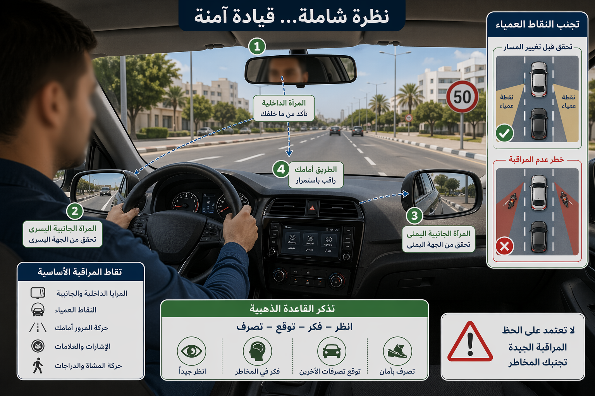
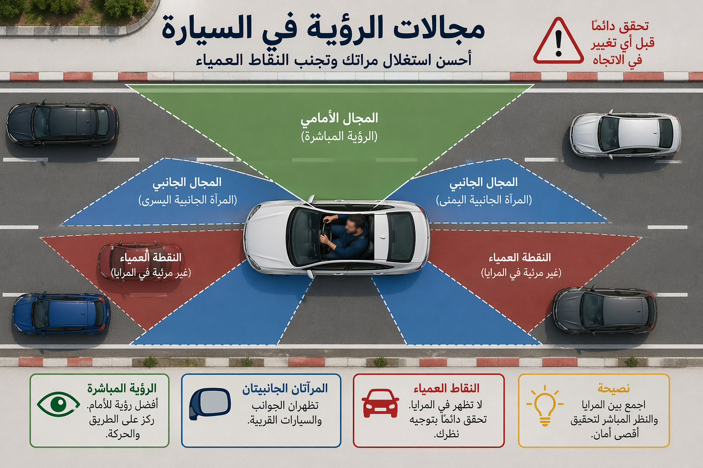
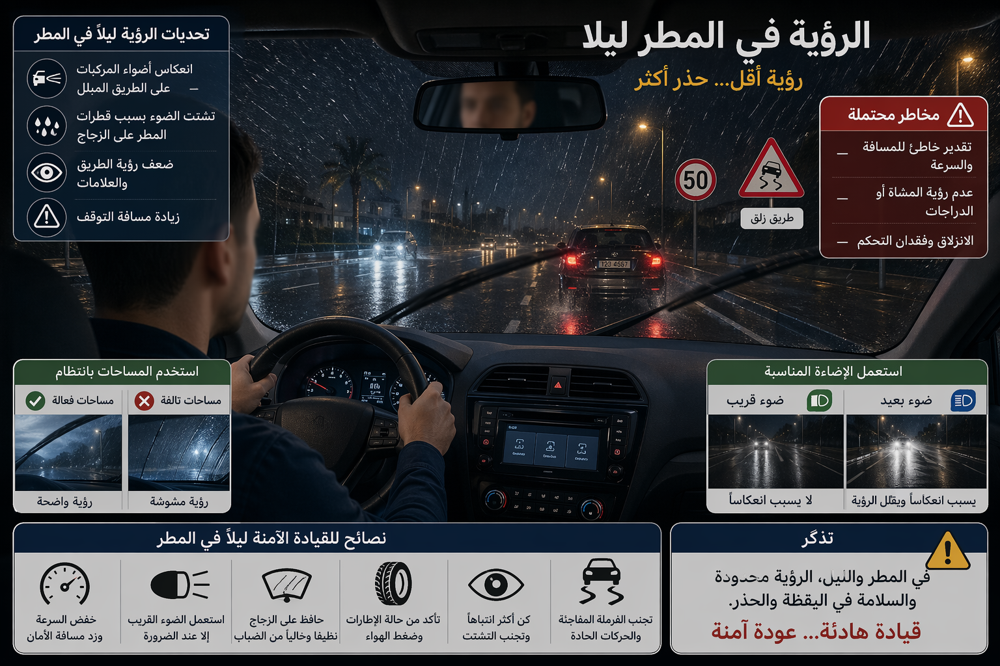
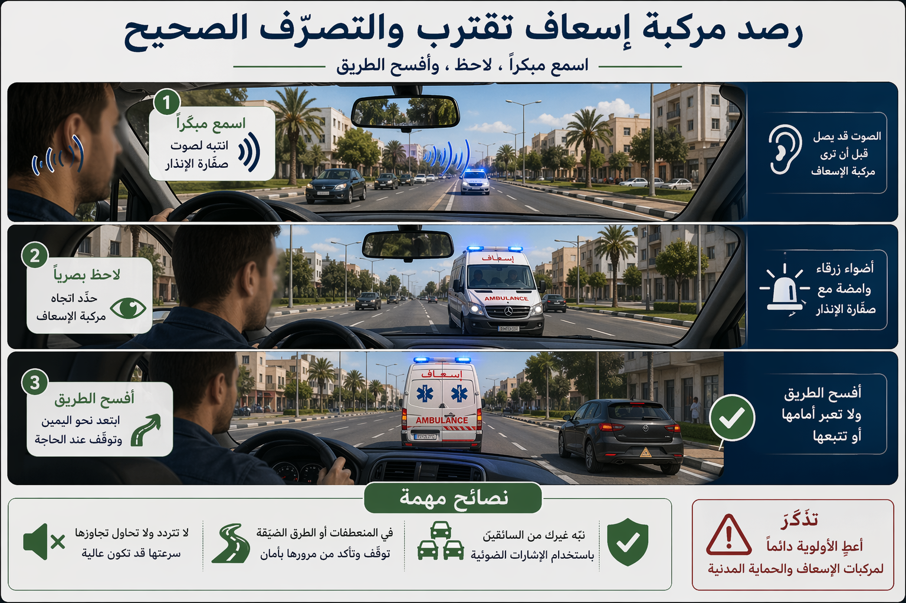

# Module : La vue et l'ouïe

## 1. Introduction
Conduire, c'est recevoir, trier et comprendre des informations en continu. La vue sert a lire la route, les trajectoires, les panneaux, les obstacles et les distances. L'ouie aide a detecter des alertes utiles : sirene, klaxon bref, bruit anormal du vehicule, approche d'un deux-roues ou d'un train. Quand l'un de ces sens est diminue, la securite repose encore plus sur l'anticipation et la prudence.

> Le saviez-vous ? Un conducteur qui roule a 90 km/h parcourt environ 25 m par seconde. Si sa perception visuelle est tardive, meme une petite hesitation peut lui faire perdre toute marge utile avant le freinage.

## 2. La vue : le premier outil de conduite

### Voir n'est pas seulement regarder
La vue du conducteur sert a :

- lire loin devant,
- surveiller les cotes,
- controler les retroviseurs,
- detecter les usagers vulnerables,
- estimer la vitesse et la distance,
- reperer les changements de signalisation.

Le conducteur doit prendre toutes les precautions necessaires pour que son champ de vision ne soit pas reduit par les passagers, leur position, le chargement ou des objets non transparents sur les vitres.

### Quelques reperes utiles

- le champ visuel humain horizontal approche 180 degres avec les deux yeux,
- la zone de vision binoculaire utile est d'environ 120 degres,
- la vision tres precise est concentree dans une zone centrale beaucoup plus etroite.

Cela veut dire qu'on peut detecter un mouvement sur le cote sans pour autant l'identifier clairement. D'ou l'importance de tourner la tete et de verifier l'angle mort avant toute manoeuvre.

### Quand la vitesse augmente, la vue utile se raccourcit
Plus on roule vite, plus le regard doit porter loin. Sinon, on voit le danger trop tard.

Repere chiffré :

- 50 km/h = environ 14 m parcourus par seconde,
- 70 km/h = environ 19 m par seconde,
- 90 km/h = environ 25 m par seconde,
- 110 km/h = environ 30 m par seconde.

La consequence est simple :

- en ville, il faut balayer souvent,
- sur route et sur autoroute, il faut porter le regard beaucoup plus loin.

## 2. L'ouie : un sens d'alerte et de confirmation

### A quoi sert l'ouie au volant
L'ouie ne remplace pas la vue, mais elle apporte des indices precieux :

- entendre une sirene avant de voir le vehicule prioritaire,
- percevoir un avertisseur bref,
- entendre un bruit anormal du moteur, du freinage ou d'un pneu,
- detecter une alerte exterieure dans une zone mal visible.

### Les limites de l'ouie
L'ouie seule ne permet pas de localiser parfaitement un danger. Elle sert a alerter, puis la vue doit confirmer.

Cela explique pourquoi il ne faut pas conduire avec un niveau sonore excessif dans l'habitacle. Si la musique couvre les signaux utiles, l'information arrive trop tard.

### Les avertisseurs sonores des autres usagers
L'usage des avertisseurs sonores est strictement encadre. Leur role est de prevenir un danger, pas de remplacer l'observation. Un conducteur attentif doit donc :

- entendre l'alerte,
- chercher l'information,
- verifier visuellement,
- agir sans panique.

## 2. Les situations qui reduisent la qualite de perception

### Mauvaises conditions de visibilite

- pluie,
- brouillard,
- nuit,
- contre-jour,
- pare-brise sale,
- eclairage defectueux.

Dans ces cas, le conducteur doit reduire sensiblement sa vitesse et, si besoin, s'arreter lorsque la visibilite ne permet plus de poursuivre en securite.

### Obstruction du champ de vision
Sont a eviter absolument :

- objets suspendus devant le pare-brise,
- vitres encombrees,
- chargement qui bloque la lunette arriere,
- passagers mal installes,
- defaut de nettoyage du pare-brise ou des retroviseurs.

Ne pas preserver son champ de vision expose a une amende de 40 dinars.

### Saturation auditive
Si l'environnement sonore est trop fort, le conducteur percoit moins vite les alertes exterieures. Il peut alors :

- rater une sirene,
- reagir tard a un klaxon bref,
- ne pas entendre un bruit technique anormal.

## 2. Comment compenser une perception moins bonne

### Avec la vue

- nettoyer le pare-brise et les retroviseurs,
- adapter la vitesse a la visibilite,
- regarder loin puis pres puis sur les cotes,
- controler frequemment les retroviseurs,
- tourner la tete avant de changer de file.

### Avec l'ouie

- reduire les sources de bruit inutiles,
- rester attentif aux signaux d'urgence,
- couper toute distraction sonore excessive en situation complexe.

### Avec la conduite
Quand la perception est moins bonne, il faut augmenter ses marges :

- plus de distance,
- moins de vitesse,
- plus d'anticipation.

## 2. Vue, ouie et partage de la route

Un bon conducteur ne pense pas seulement a ce qu'il voit ou entend. Il pense aussi a ce que les autres voient de lui.

Il doit donc :

- bien signaler ses intentions,
- garder des feux en bon etat,
- eviter les manoeuvres brusques,
- respecter les trajectoires lisibles.

Une bonne perception et une bonne communication vont toujours ensemble.

## 3. Le conseil du moniteur :
> Tes yeux lisent la route, tes oreilles te previennent, mais c'est ton anticipation qui transforme ces informations en securite.

###
