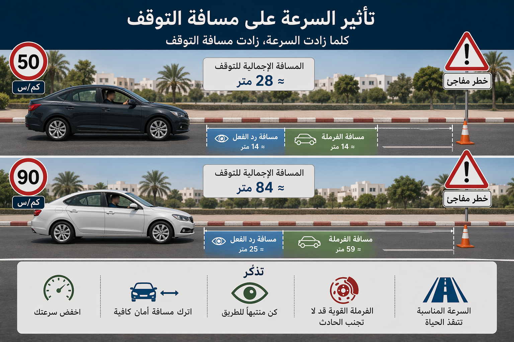
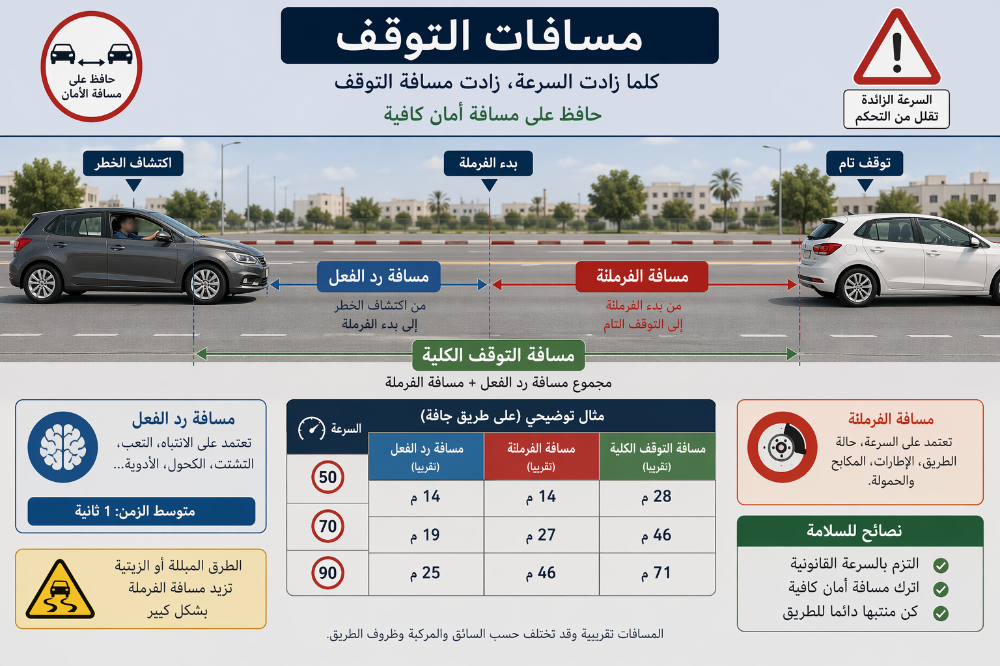
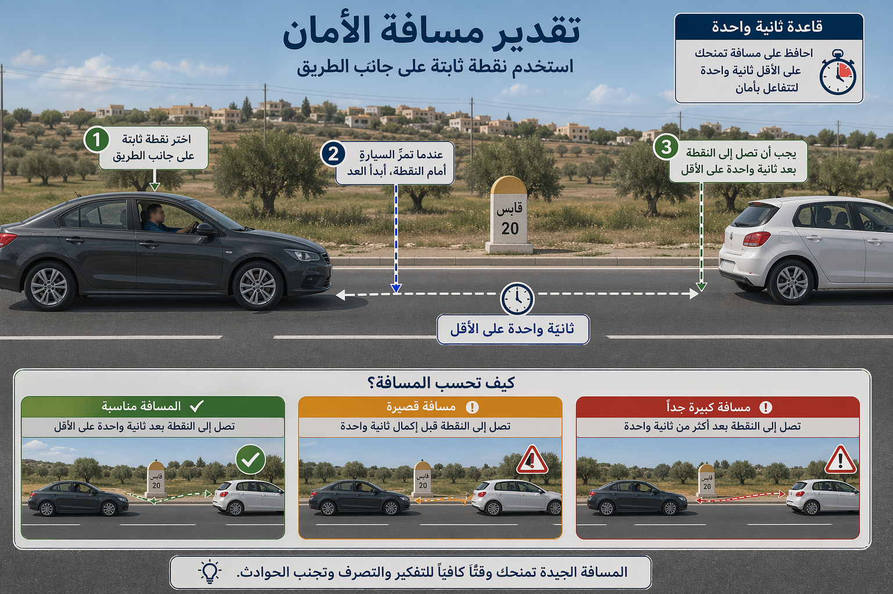
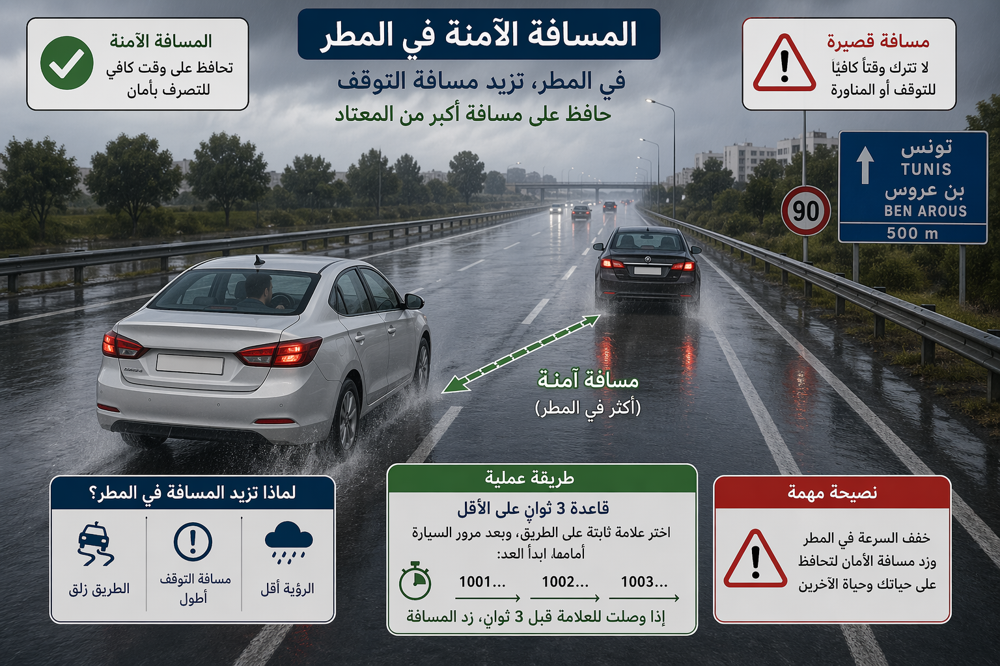

# Module : Les distances

## 1. Introduction
Sur la route, beaucoup de collisions ne viennent pas d'une absence de freinage, mais d'un freinage trop tardif. Les distances donnent au conducteur le temps d'analyser, de reagir et d'arreter son vehicule sans heurter celui qui le precede. Plus la vitesse augmente, plus l'erreur se paie cher.

> Le saviez-vous ? En Tunisie, l'exces de vitesse represente environ 30,1% des accidents mortels dans les donnees d'accidentologie diffusees par l'ONSR. Or, la vitesse ne tue pas seule : elle allonge aussi toutes les distances utiles.

## 2. Les trois distances a bien distinguer

### La distance de reaction
C'est la distance parcourue entre le moment ou le conducteur percoit le danger et le moment ou il commence a agir.

Repere simple :

- a 50 km/h, environ 14 m en 1 seconde,
- a 90 km/h, environ 25 m en 1 seconde,
- a 110 km/h, environ 30 m en 1 seconde.

### La distance de freinage
C'est la distance parcourue entre le debut du freinage et l'arret du vehicule.

Elle augmente avec :

- la vitesse,
- l'etat des pneus,
- l'etat des freins,
- la charge,
- l'etat de la chaussee,
- la pluie ou le gravier.

### La distance d'arret
Elle correspond a :

- distance de reaction + distance de freinage.

Autrement dit, un conducteur ne s'arrete jamais a l'instant ou il voit le danger.

## 2. La distance de securite en Tunisie

### La formule a connaitre
La distance de securite minimale est estimee selon la formule suivante :

**Distance de securite en metres = vitesse en km/h x 3 / 10**

Exemples :

- 60 km/h = 18 m,
- 70 km/h = 21 m,
- 80 km/h = 24 m,
- 90 km/h = 27 m,
- 100 km/h = 30 m,
- 110 km/h = 33 m.

Cette distance correspond a environ une seconde de parcours pour un conducteur disposant de ses capacites physiques et mentales normales.

### Pourquoi cette formule est utile
Elle permet au conducteur de garder une marge meme si le vehicule devant ralentit brusquement ou s'arrete de facon imprévue.

### Les vehicules lourds
Pour les vehicules dont le poids total autorise en charge ou le poids total roulant autorise depasse 3500 kg, ou dont la longueur depasse 7 m, la distance minimale hors agglomeration et sur autoroute est :

- 75 m pour les vehicules transportant des matieres dangereuses,
- 50 m pour les autres vehicules.

## 2. Comment estimer rapidement la bonne distance

### Methode pratique
Choisissez un point fixe sur le bord de la route. Quand le vehicule devant le depasse, comptez calmement :

- une seconde minimum dans de bonnes conditions,
- davantage si la route est mouillee, de nuit ou si vous etes fatigue.

### Quand faut-il augmenter la distance

- sous la pluie,
- sur chaussee glissante,
- la nuit,
- dans le brouillard,
- si vous suivez une moto,
- si vous etes charge,
- si vous etes fatigue,
- si le conducteur devant vous est hesitant.

## 2. Les erreurs classiques a eviter

### Rouler "colle"
Suivre de trop pres laisse croire qu'on gagne du temps. En realite, on perd toute capacite de reaction.

### Adapter sa distance au seul ressenti
Le ressenti est trompeur, surtout a vitesse elevee.

### Oublier que la pluie change tout
Sur route mouillee, la distance d'arret augmente. La distance de securite doit donc etre nettement allongee.

### Freiner au dernier moment
Un bon conducteur ne freine pas "fort". Il anticipe tot.

## 2. Distances et sanctions

Le conducteur doit laisser une distance de securite suffisante avec le vehicule qui le precede. Ce n'est pas une recommandation de confort, c'est une regle de circulation.

Quand un conducteur roule trop pres, il augmente :

- le risque de collision arriere,
- le risque de freinage panique,
- le risque de carambolage si plusieurs vehicules se suivent.

Dans la pratique pedagogique, rouler trop pres est aussi souvent le signe d'une mauvaise lecture de la vitesse et d'une anticipation insuffisante.

## 2. Distances et autres notions utiles

### Distance laterale
Lors d'un croisement ou d'un depassement, il faut aussi laisser une distance laterale suffisante. La securite n'est pas seulement devant, elle est aussi sur le cote.

### Distance et communication
Plus la distance est correcte, plus les feux stop du vehicule devant sont vus tot, compris tot et traites calmement.

### Distance et fatigue
Un conducteur fatigue doit augmenter sa marge, car son temps de reaction sera souvent moins bon.

## 3. Le conseil du moniteur :
> La bonne distance, ce n'est pas l'espace que tu laisses pour suivre quelqu'un, c'est l'espace que tu te gardes pour rester maitre de ta conduite.

###
