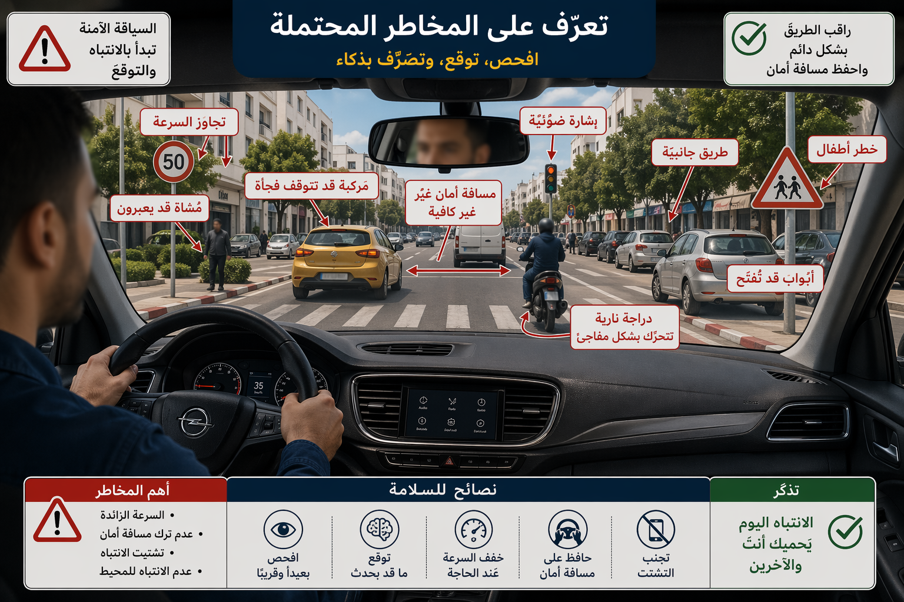
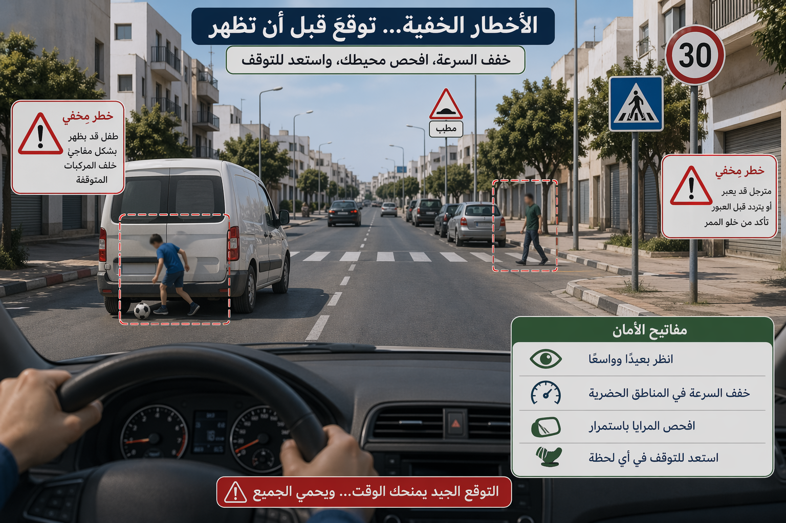
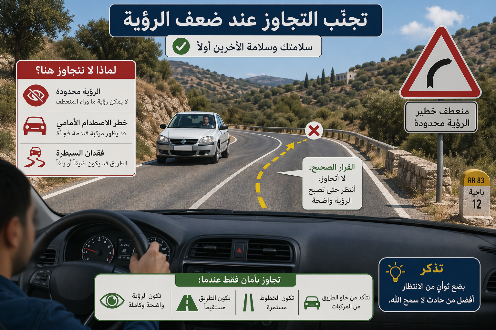
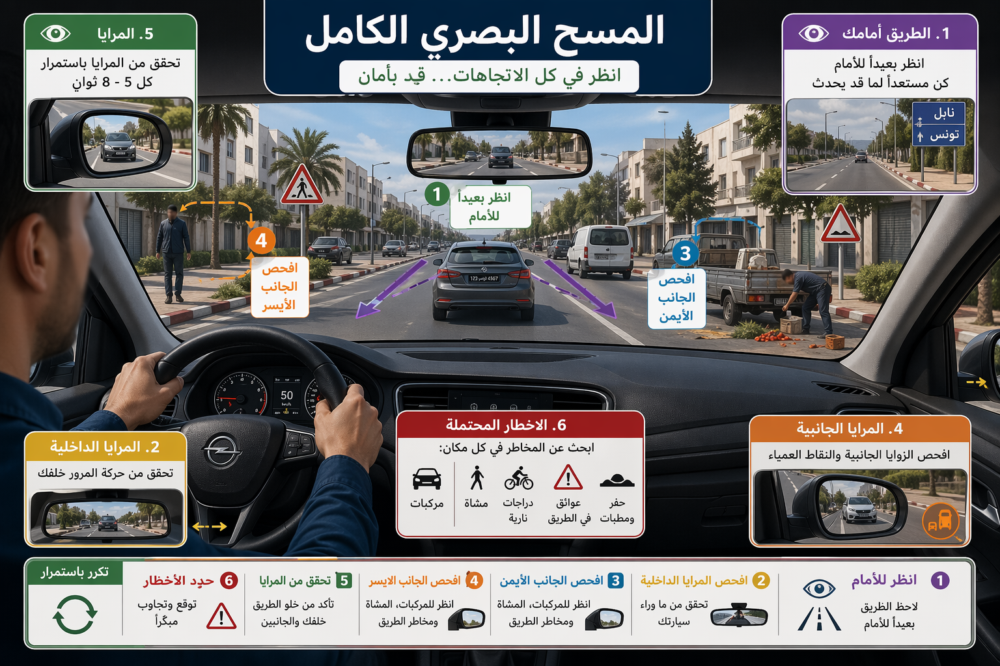

# Module : Les risques et les dangers potentiels

## 1. Introduction
Un bon conducteur ne conduit pas seulement dans le present. Il conduit quelques secondes en avance. Il cherche les indices faibles, les situations qui peuvent mal tourner et les usagers qui peuvent faire un mauvais choix. Cette lecture anticipée permet d'eviter le danger avant qu'il ne devienne une urgence.

> Le saviez-vous ? Dans les donnees d'accidentologie diffusees par l'ONSR, l'inattention et l'etourderie concernent plus de 42% des accidents, l'exces de vitesse environ 30,1% des accidents mortels, et le depassement interdit environ 7,4% des accidents mortels. Le risque vient donc souvent d'un danger mal anticipe.

## 2. Savoir reconnaitre un danger potentiel

### Un danger potentiel, c'est quoi
C'est une situation qui n'est pas encore un accident, mais qui peut le devenir tres vite.

Exemples :

- un pieton proche du bord de la chaussee,
- une voiture arretee dont une porte peut s'ouvrir,
- un enfant pres d'une ecole,
- un vehicule masque par un obstacle,
- un conducteur qui ralentit sans raison claire,
- un deux-roues qui zigzague,
- un carrefour mal visible,
- un sommet de cote,
- une pluie soudaine.

### Le principe cle : voir tot
Plus on voit tot, plus on peut :

- ralentir calmement,
- se placer correctement,
- communiquer,
- s'arreter si besoin.

Repere chiffré :

- a 50 km/h, 2 secondes = environ 28 m,
- a 90 km/h, 2 secondes = environ 50 m.

Deux secondes d'anticipation changent deja beaucoup la securite d'une manoeuvre.

### Les endroits ou le danger est souvent cache

- intersections,
- virages,
- sommets de cote,
- passages pour pietons,
- abords des ecoles,
- sorties d'usine ou de chantier,
- arrets de transport public,
- routes etroites ou encombrees.

Le conducteur doit d'ailleurs reduire sensiblement sa vitesse dans plusieurs de ces situations.

## 2. Les familles de risques a surveiller

### Les risques lies aux autres usagers

- pieton qui traverse brusquement,
- deux-roues qui remonte entre les files,
- conducteur distrait,
- vehicule lourd qui tourne large,
- conducteur agressif ou presse.

### Les risques lies a l'infrastructure

- chaussee glissante,
- travaux,
- gravillons,
- retrecissement,
- marquage efface,
- eclairage insuffisant,
- visibilite reduite.

### Les risques lies a soi-meme

- fatigue,
- stress,
- distraction,
- telephone,
- vitesse excessive,
- mauvaise distance de securite.

Le danger potentiel n'est pas toujours dehors. Il peut aussi venir du conducteur lui-meme.

## 2. Comment evaluer le niveau de risque

### Les trois questions a se poser

1. Qu'est-ce qui peut arriver ici ?
2. Si cela arrive, ai-je assez de temps pour reagir ?
3. Que puis-je faire tout de suite pour augmenter ma marge ?

### Les bons ajustements

- ralentir,
- elargir la distance de securite,
- se replacer correctement,
- couvrir le frein,
- renforcer l'observation,
- renoncer a une manoeuvre si la visibilite est mauvaise.

### Le cas du depassement
Le depassement est interdit des qu'il peut constituer un danger pour la circulation ou risquer de causer un accident, notamment en raison des difficultes de visibilite ou des caracteristiques techniques de la route.

Cela explique pourquoi un danger potentiel doit etre traite tot : une bonne anticipation evite de se retrouver engage dans une manoeuvre impossible a finir.

## 2. La reduction du risque par la vitesse

La vitesse doit toujours etre adaptee :

- a la signalisation,
- a l'etat de la route,
- aux conditions atmospheriques,
- a la densite de circulation,
- aux obstacles previsibles,
- aux caracteristiques du vehicule et de son chargement.

Repere pratique :

- a 30 km/h, environ 8 m sont parcourus en 1 seconde,
- a 50 km/h, 14 m,
- a 90 km/h, 25 m.

Plus la vitesse augmente, plus un danger potentiel devient vite un danger immediat.

## 2. Les erreurs qui transforment un risque en accident

### Regarder sans analyser
Voir un danger ne suffit pas. Il faut comprendre ce qu'il peut produire.

### Attendre la derniere seconde
Le danger potentiel doit etre traite avant qu'il force un freinage d'urgence.

### Se focaliser sur un seul point
Un bon balayage visuel doit aller :

- loin devant,
- pres devant,
- sur les cotes,
- dans les retroviseurs.

### Suivre le mouvement des autres sans reflechir
Si un autre conducteur force, depasse mal ou change brutalement de voie, il ne faut jamais se laisser entrainer.

## 2. Sanctions et responsabilite

Beaucoup de sanctions de circulation sont en realite liees a une mauvaise gestion des dangers potentiels :

- changement de direction sans precaution ni signalisation : 60 dinars,
- usage du telephone mobile en conduisant : 60 dinars,
- depassement interdit : delit puni d'une amende de 120 a 200 dinars ou d'un emprisonnement pouvant aller jusqu'a un mois,
- conduite sous etat alcoolique : delit grave avec amende de 200 a 500 dinars et retrait possible du permis.

Ces sanctions rappellent une idee simple : le danger n'est pas juge seulement quand l'accident arrive. Il est aussi sanctionne des que le comportement cree un risque inacceptable.

## 3. Le conseil du moniteur :
> Sur la route, celui qui voit le danger seulement quand il est devant le capot a deja perdu du temps ; celui qui l'anticipe a deja commence a l'eviter.

###
